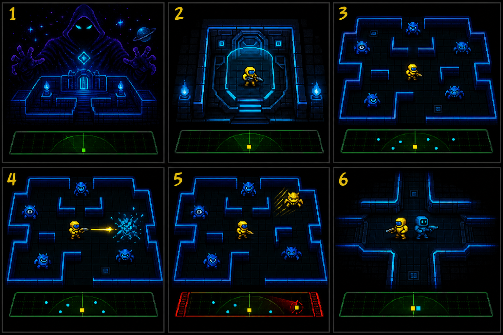
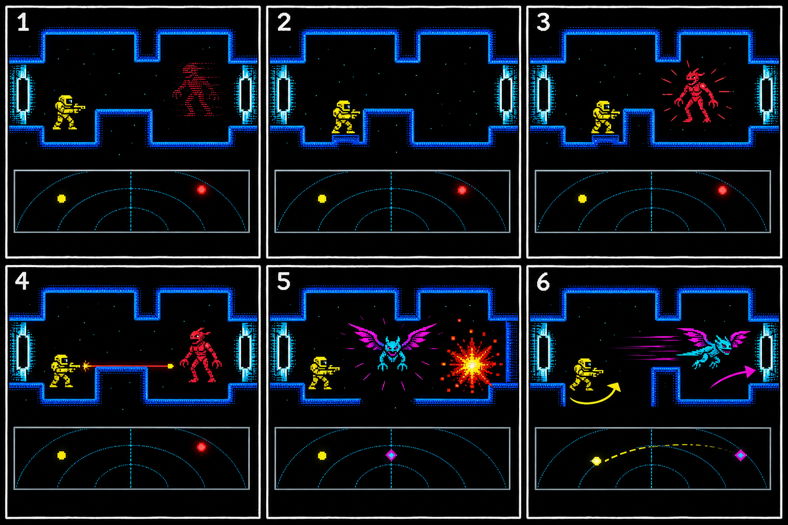
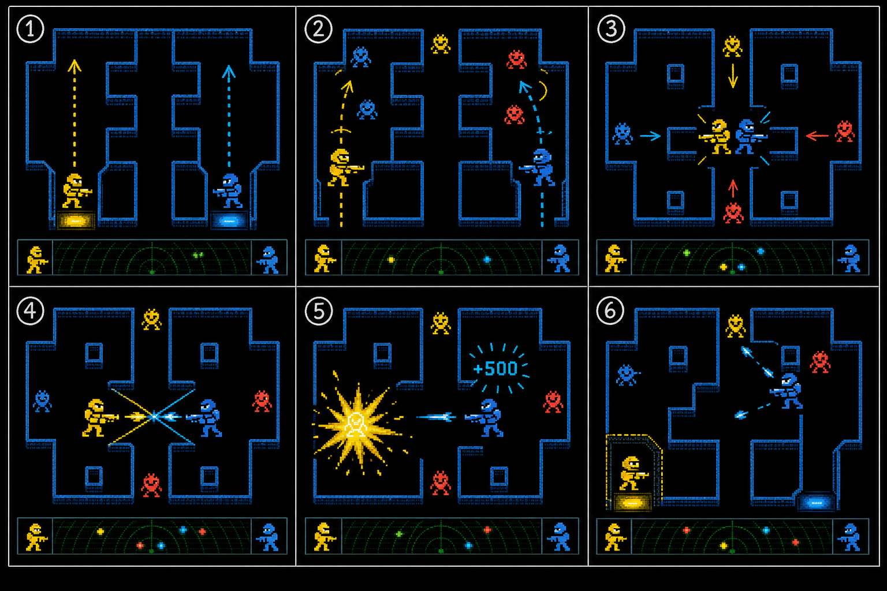
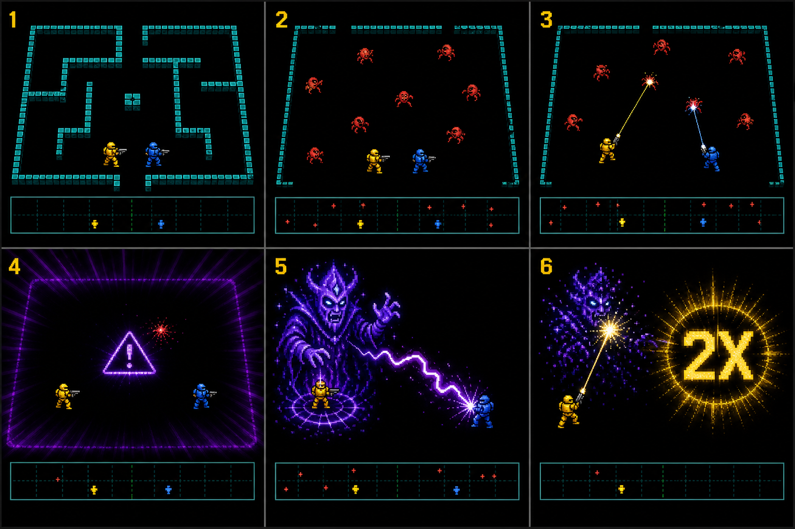

# Experience Storyboards

These storyboards describe player-facing sequences, not cinematics. Each panel is a testable change in information, intent, or pressure. The visual sheets are exploratory concept art generated for this package; written panel definitions are authoritative when an image is ambiguous.

## Visual language

| Element | Meaning |
|---|---|
| Gold delver | Human player one |
| Cyan delver | Human player two or solo AI companion |
| Blue / amber / scarlet creature | Tier 1 / 2 / 3 regular threat |
| Cyan-magenta winged creature | Escape target / Riftwing |
| Violet spectral figure | Host / Gaoler |
| Green/cyan lower strip | Radar, deliberately without maze walls |
| Bright lateral aperture | Available side gate |
| Dark lateral aperture | Temporarily sealed side gate |

## SB-01 — The first ninety seconds



**Purpose:** Establish premise, controls, one-shot combat, escalation, radar, and companionship without a tutorial scene.

| Panel | On-screen beat | Player thought/action | Audio and feedback | Design purpose |
|---:|---|---|---|---|
| 1 | In attract mode, a vast shadow host looms over a tiny luminous dungeon. A demonstration run flickers below. | “This is a hostile place I can enter immediately.” Any input interrupts. | Original synthetic taunt; low portal hum. | Establish scale, tone, and antagonist personality in seconds. |
| 2 | Gold waits in the lower-right protected alcove. A short countdown and a single direction icon point into the maze. | Push into the maze now, or use the safe moment to inspect. | Countdown ticks only in final seconds. | Teach voluntary versus forced entry. |
| 3 | Six blue Prowlers occupy readable lanes. Cyan companion appears opposite. Radar lights with six shaped threat blips. | Move through four-way corridors; notice a partner shares the room. | Entry gate seals with a soft thud; movement has restrained foot pulses. | Present the full tactical instrument without advanced danger. |
| 4 | A Prowler approaches a short corridor. Gold faces, fires once, and the hit resolves quickly. | Learn: face first, then commit the shot. | Strong fire tone, wall-safe hit crack, score `+100`. | First success is legible and low risk. |
| 5 | The defeated Prowler’s energy reforms as an amber Veilmaw. Its body begins to fade while its radar blip remains. | “A kill made the room more dangerous; the lower strip still knows where it is.” | Transformation chord, cloak descent, brief radar pulse. | Teach succession and radar as one connected rule. |
| 6 | Gold and cyan meet at a junction, face opposite lanes, and cover each other as threats approach. | Hold a lane and avoid crossing the partner’s weapon line. | Stereo shot-ready clicks; host comments on the uneasy alliance. | End onboarding on the game’s social promise. |

**Exit condition:** Player can state that enemies transform, cloaked enemies remain on radar, and the partner’s line of fire matters.

## SB-02 — Invisible hunt and Riftwing chase



**Purpose:** Demonstrate fair invisibility, shot commitment, phase change, gate prediction, and the future-value reward.

| Panel | On-screen beat | Player thought/action | Audio and feedback | Design purpose |
|---:|---|---|---|---|
| 1 | A scarlet Ravager dissolves from the maze. Its distinct radar blip continues moving. | Stop chasing the vanished sprite; acquire it below. | Cloak tone pans toward the last visible location. | Hide presentation, not information. |
| 2 | Gold tucks beside a short wall while the radar blip approaches a nearby corridor. | Choose cover and align before the reveal. | Radar emits a quiet proximity pulse; weapon-ready cue is lit. | Reward anticipation rather than reflex alone. |
| 3 | Ravager enters Gold’s unobstructed corridor and flashes visible. | Confirm target and facing. | Sharp reveal chirp; no host speech over this cue. | Provide a fair action window. |
| 4 | Gold fires the only live shot. The Ravager evades late or is hit; until impact, Gold cannot fire again. | Commit, then reposition rather than mashing fire. | Shot tone remains faintly active until resolution. | Make spatial cost of a miss perceptible. |
| 5 | The last regular threat bursts. Objective changes instantly to CATCH; Riftwing erupts near center. | Switch mental mode from methodical clear to fast pursuit. | Tempo jumps; unique wing pulse; host announces the escape. | Turn stage completion into a climax. |
| 6 | Riftwing races toward the right gate. Gold pivots while the opposite gate is temporarily sealed. | Predict route, use a short lane, and shoot before escape. | Gate hum rises; successful hit arms `NEXT ×2`; escape ends the cadence unresolved. | Link gate state, route planning, and next-stage value. |

**Exit condition:** The player knows that the radar makes cloaking fair and that capturing Riftwing affects the following dungeon, not the current regular wave.

## SB-03 — Trust, crossfire, and recovery



**Purpose:** Show why simultaneous play is neither pure co-op nor a separate versus mode.

| Panel | On-screen beat | Player thought/action | Audio and feedback | Design purpose |
|---:|---|---|---|---|
| 1 | Gold and cyan leave opposite lower alcoves. Their scores and reserve icons flank the shared radar. | Each player owns a squad and score but shares the room. | Two distinct entry tones and controller-color prompts. | Establish ownership without split-screen separation. |
| 2 | Players take parallel lanes, pulling threats into separate regions. | Verbally divide coverage and reduce crossfire. | Positional weapon-ready cues differentiate players. | Reward simple coordination immediately. |
| 3 | Both regroup back-to-back at the central junction as threats close from several directions. | Trust the partner to hold the rear lane. | Threat tempo rises; radar density peaks. | Create the iconic cooperative formation. |
| 4 | Players pivot at once. Gold steps across cyan’s committed shot lane. Projectiles cross in a readable instant. | Recognize the danger a fraction too late. | Cyan-colored shot trail; short warning sting on line crossing. | Make friendly fire attributable, not mysterious. |
| 5 | Gold bursts. Cyan receives the Classic rules score pulse; the host laughs. No gore and no long freeze. | The pair decides whether it was an accident, revenge, or a new scoring strategy. | Distinct partner-hit sound; score `+1,000`; concise source icon. | Create social drama inside the cooperative run. |
| 6 | Cyan holds the remaining threats while Gold waits in the reopened alcove for a safe re-entry window. | Survivor creates space; fallen player chooses when to return. | Re-entry countdown; partner can call the moment. | Convert death into a cooperative recovery decision. |

**Exit condition:** Players understand that Classic friendly fire is intentional, visibly owned, and tactically recoverable. Alliance mode uses the same sequence but cancels the lethal result and score.

## SB-04 — The Pit and the Gaoler



**Purpose:** Deliver the first run climax using geometry, speed, and antagonist behavior rather than extra health.

| Panel | On-screen beat | Player thought/action | Audio and feedback | Design purpose |
|---:|---|---|---|---|
| 1 | Transition names Dungeon 13 as THE PIT. Interior walls retract or fail to draw, leaving an exposed arena. | “All the safe habits based on cover are gone.” | Original Pit motif; host gives a short challenge. | Announce a rules exam without a cutscene. |
| 2 | Fast Ravagers spread across the open field. Gold and cyan cannot anchor behind walls. | Move continuously and maintain separation. | Sparse ambience makes movement and fire cues stark. | Stress pure positioning and lane discipline. |
| 3 | Both players fire precise shots and sidestep incoming lines. A miss travels a long distance before freeing the weapon. | Only fire with a plan; cover the partner’s recovery window. | Long live-shot tone makes lockout obvious. | Combine all mastered systems under exposure. |
| 4 | The final regular falls. A violet warning distorts the border before the room can relax. | Reposition immediately; a host duel may follow. | Music drops out; spatial teleport crack telegraphs danger. | Deny the usual post-clear exhale in a fair way. |
| 5 | The Gaoler materializes behind cyan, hurls one lightning bolt, and begins to destabilize. | Gold may rescue cyan by firing across the arena, risking friendly fire. | Bolt has unique directionality; voice ducks until it passes. | Turn the antagonist into a test of cooperation and precision. |
| 6 | Gold’s shot lands during the vulnerability window. The Gaoler dissolves and `NEXT ×2` arms for dungeon 14. | Survive, celebrate briefly, choose to continue the valuable run. | Strong hit cadence, short title upgrade, immediate next-entry hum. | Give the endless run a memorable first climax and continuation hook. |

**Exit condition:** Players read the Pit as a mastery exam, understand the Gaoler’s teleport-fire-vulnerability cycle, and feel motivated to cash the newly armed multiplier.

## Combined emotional arc

```text
Curiosity → competence → unease → trust
    → suspense → pursuit → greed
    → cooperation → accident → negotiation
    → exposure → panic → triumph → “one more dungeon”
```

## Storyboard validation checklist

- Can each panel be understood at thumbnail size without its caption?
- Is the objective state clear: CLEAR, CATCH, or SURVIVE?
- Is every hidden threat still represented on radar?
- Is the owner and direction of every shot legible?
- Does a player death have an identifiable cause?
- Is `NEXT ×2` visually distinct from `×2 NOW`?
- Does the side-gate state remain readable during a chase?
- Are Gold and Cyan silhouettes distinguishable without color?
- Do effects preserve active projectile lanes?
- Does every voice moment leave room for critical effects?

