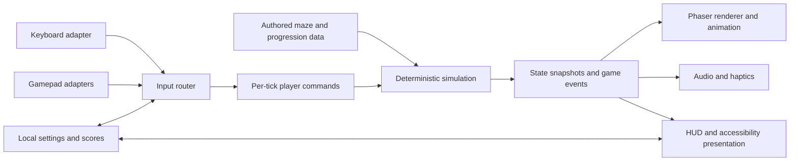

# Technical Implementation Plan

## Project Worbound — browser release

**Document version:** 1.0  
**Date:** 2026-08-21  
**Status:** Recommended implementation baseline  
**Target:** Desktop web browsers, keyboard, one or two game controllers, local shared-screen play  
**Related documents:** [Game design document](./02-game-design-document.md), [asset package](../../assets/README.md)

## 1. Executive decision

Build Project Worbound as a client-only TypeScript web game using Phaser 4.2.1 as the presentation/runtime framework and Vite as the development and production build system. Keep authoritative game rules in a deterministic, engine-independent simulation module. Adapt keyboard and browser Gamepad API input into the same small set of player intentions. Ship the result as versioned static files over HTTPS.

The first release requires no application server, account system, database, or network session. Local scores, settings, controller mappings, and discovered practice levels remain on the device. Online leaderboards and online multiplayer are separate product decisions because either would introduce identity, abuse prevention, privacy, operations, and—in multiplayer’s case—netcode.

### Recommended stack

| Concern | Decision | Why it fits |
| --- | --- | --- |
| Language | TypeScript with strict checking | Explicit game-state contracts, safe content schemas, and refactorable input/state code |
| Game framework | Phaser 4.2.1, pinned exactly | Browser-native WebGL/Canvas renderer with scenes, textures, audio, scaling, keyboard, and gamepad integration |
| Rule simulation | Framework-free TypeScript module | Deterministic tests and no coupling between game rules and frame rate, renderer, or device APIs |
| Build/dev server | Vite, pinned to one tested version | Fast development loop and optimized static `dist/` output |
| Unit/content tests | Vitest plus custom validators | Fast simulation, collision, progression, maze, input, and manifest checks |
| Browser tests | Playwright | Keyboard journeys and visual checks across Chromium, Firefox, and WebKit |
| Hosting | Any HTTPS static host/CDN; GitHub Pages is the reference deployment | No server runtime; preview builds and rollback are straightforward |
| Persistence | Versioned `localStorage` records initially | Enough for settings and local high scores; no backend dependency |
| Offline install | PWA/service worker after beta stability | Valuable for a self-contained arcade game, but cache update behavior must be proven first |

Phaser 4.2.1 was released on 2026-07-09 and includes ESM, Scale Manager, and tween-start fixes relevant to this project. Pinning avoids an unreviewed engine update changing input, rendering, or scene behavior mid-release. See the [Phaser 4.2.1 release page](https://phaser.io/download/release/v4.2.1) and [official Phaser documentation](https://docs.phaser.io/).

## 2. Scope and boundaries

### Initial browser release includes

- Solo play with the cyan AI companion.
- Two-player Classic and Alliance local shared-screen modes.
- Practice mode.
- Keyboard-only, controller-only, and mixed keyboard/controller sessions.
- All designed combat, enemy succession, cloak/radar play, gates, re-entry, Riftwing, Gaoler, scoring, Arena, Pit, and endless continuation.
- Settings, accessibility controls, local scores, and quick restart.
- Responsive 16:9 display, fullscreen, pause/resume, and browser focus handling.
- Static HTTPS deployment with preview and production channels.

### Explicitly deferred

- Online multiplayer, matchmaking, remote play, rollback netcode, or spectator networking.
- Server-authoritative/global leaderboards and user accounts.
- Mobile/touch gameplay as a supported control scheme.
- Native console storefront SDKs, achievements, cloud saves, or commerce.
- User-authored levels or downloadable content.
- Spoken Gaoler dialogue until casting, recording, and localization are approved.

The engine decision supersedes the GDD’s earlier “no decision yet” note; the gameplay rules and non-goals remain authoritative.

## 3. Research conclusions and browser constraints

1. **The browser controller path is viable but must be normalized.** The Gamepad API is broadly available, and Phaser exposes connection, disconnection, buttons, D-pad, and axes. Device IDs and indices are not stable identities; a disconnected slot can be reused. The application must own player assignment and mappings instead of treating `gamepad.index` as “player number.” [W3C Gamepad specification](https://www.w3.org/TR/gamepad/), [Phaser input guide](https://docs.phaser.io/phaser/concepts/input).
2. **A controller is not exposed until the user interacts with it.** The current specification permits `getGamepads()` to return an empty list until a gamepad gesture is observed as a fingerprinting mitigation. The title screen must therefore say “press a button to join” and handle late discovery/hot-plug. [W3C Gamepad specification, `getGamepads()`](https://www.w3.org/TR/gamepad/#dom-navigator-getgamepads).
3. **Sound cannot be assumed to start on page load.** Audible HTML media and Web Audio are normally blocked until user interaction. The boot flow must attempt to resume audio in response to input, display a clear muted/locked state when necessary, and never block gameplay if sound remains unavailable. [MDN autoplay guide](https://developer.mozilla.org/en-US/docs/Web/Media/Guides/Autoplay).
4. **Background tabs cannot advance normally.** Browsers commonly stop `requestAnimationFrame()` callbacks for hidden pages. A hidden or blurred game must pause and discard elapsed wall time rather than simulate a large catch-up step when the tab returns. [MDN Page Visibility API](https://developer.mozilla.org/en-US/docs/Web/API/Page_Visibility_API).
5. **The product can ship as static files.** Vite produces a static production bundle in `dist/`; its base-path support allows root domains or repository subpaths. [Vite production build guide](https://vite.dev/guide/build), [Vite static deployment guide](https://vite.dev/guide/static-deploy.html).
6. **Offline play is a good second-stage enhancement.** A service worker can pre-cache versioned app resources for responsiveness and offline use, but stale caches and update activation need explicit UX and tests. Service workers require HTTPS outside localhost. [MDN PWA caching guide](https://developer.mozilla.org/en-US/docs/Web/Progressive_web_apps/Guides/Caching), [MDN service-worker guide](https://developer.mozilla.org/en-US/docs/Web/API/Service_Worker_API/Using_Service_Workers).

## 4. System shape



The simulation owns truth. Phaser owns presentation, asset loading, scene transitions, and access to browser input/audio. A renderer may interpolate visuals, but it may never change world rules. Sound, effects, and haptics react to emitted events and are not consulted to resolve gameplay.

### Dependency direction

```text
Browser shell / Phaser scenes / adapters
                 ↓
        application orchestration
                 ↓
      deterministic game simulation
                 ↓
      data types and pure utilities
```

Lower layers must not import Phaser, DOM APIs, storage, or wall-clock time. This boundary is the most important architectural rule in the plan.

## 5. Proposed repository layout

```text
src/
├── app/                    # bootstrap, browser lifecycle, build/version display
├── scenes/                 # Boot, Attract, Menu, Gameplay, HUD, Results
├── game/
│   ├── sim/                # deterministic state, systems, collisions, scoring
│   ├── model/              # entities, enums, commands, events, snapshots
│   ├── content/            # typed loaders for mazes and progression tables
│   ├── ai/                 # companion and enemy decision policies
│   └── replay/             # seed + command recording, initially test-facing
├── input/                  # keyboard, gamepad, assignment, remapping, prompts
├── presentation/           # render binding, animations, cameras, HUD, VFX
├── audio/                  # buses, cue map, music state, unlock handling
├── persistence/            # versioned settings and local scores
└── accessibility/          # presentation/input presets and captions
content/
├── mazes/                  # authored, linted JSON maze definitions
├── progression/            # dungeon bands, spawn chains, scoring, tuning
└── schemas/                # build-time content schemas
public/runtime-assets/      # optimized deployment assets only
tests/
├── unit/
├── simulation/
├── content/
├── browser/
└── fixtures/replays/
tools/assets/               # atlas conditioning, audio conversion, manifests
assets/                     # current high-resolution/source production package
```

The existing `assets/` package remains the source of truth. Web-ready derivatives are generated into `public/runtime-assets/`; they are not hand-edited.

## 6. Simulation architecture

### 6.1 Time model

- Run gameplay at a fixed 60 Hz simulation tick.
- Accumulate render-frame elapsed time and process only a capped number of ticks per animation frame.
- Never use render-frame delta directly for movement, firing, AI, scoring, timers, or collision.
- When the page becomes hidden, loses focus, or the controller disconnects during live play, enter a deliberate pause state. On resume, clear the accumulator.
- Keep animation interpolation optional and presentation-only.

This makes collision ordering reproducible and directly implements the GDD’s simultaneous-event contract.

### 6.2 State and commands

The world state should be one serializable object graph containing:

- run seed, tick number, mode, dungeon and phase;
- maze geometry, gate state, spawn points, and reserved alcoves;
- delvers, reserves, facing, live-shot ownership, scores, and multiplier state;
- regular enemies and their succession links;
- Riftwing/Gaoler state machines;
- projectiles, collisions pending resolution, timers, and phase queues;
- AI memory limited to information the design permits it to know.

Each human slot supplies one command per tick:

```text
move: neutral | north | east | south | west
fire: pressed edge
aim modifier: held
pause: pressed edge
```

Commands describe intent, not key codes or button numbers. The simulation therefore cannot tell whether the source was a keyboard, Xbox controller, DualSense, replay file, AI driver, or test fixture.

### 6.3 Update pipeline

One tick uses an explicit, test-covered order:

1. Accept player/AI commands and resolve tap-to-pivot intent.
2. Advance phase timers and gate traversal already in progress.
3. Move delvers, enemies, and projectiles.
4. Resolve projectile-versus-projectile interactions.
5. Resolve projectile-versus-character interactions.
6. Resolve hostile contact.
7. Apply deaths, score, succession spawns, multiplier changes, and phase transitions.
8. Advance enemy intent state machines.
9. Emit immutable presentation events and produce the next snapshot.

Exact ordering must match section 9 of the GDD and be locked by regression tests.

### 6.4 Collision and movement

- Represent the maze as a logical tile grid with explicit solid edges, floor, gates, and spawn markers.
- Use grid-aware cardinal movement and actor collision boxes smaller than decorative sprite bounds.
- Use swept segment/cell traversal for fast projectiles so they cannot tunnel through a wall or actor between ticks.
- Resolve ties with stable entity IDs and documented priority rules; never rely on array insertion order.
- Keep decorative glow, particles, shadows, and cloak distortion out of collision data.

### 6.5 Determinism and replays

- Use one seeded project PRNG; do not use `Math.random()` in simulation code.
- Record build/content version, initial seed, mode, settings that affect rules, and per-tick player commands.
- Hash selected world state periodically in development builds.
- Keep compact replay fixtures for collision cases, Dungeon 1 onboarding, Riftwing resolution, and Gaoler phases.

Replay recording is initially a quality tool, not a user feature. It makes bugs reproducible and preserves a future path to ghost play, score verification, or rollback networking without promising any of them.

## 7. Input and controller plan

### 7.1 Input router

Maintain two logical player slots. Each slot binds to one active device profile:

- `keyboard-profile-a`;
- `keyboard-profile-b`;
- a session gamepad binding;
- AI;
- replay/test driver.

Any keyboard and controller combination is legal. Two controllers can join; one controller plus one keyboard can join; two players can share a keyboard if the hardware supports the key combination. The join screen owns assignments and prevents one physical device from controlling both players accidentally.

### 7.2 Default bindings

| Action | Keyboard A | Keyboard B | Standard controller |
| --- | --- | --- | --- |
| Move / face | W A S D | Arrow keys | D-pad or left stick |
| Fire / confirm | F or Space | Slash or Enter | South face button |
| Aim modifier | G | Period | West face button |
| Pause | Escape | Escape | Start/Menu |

Every gameplay binding is remappable. Menu labels use actions (“Fire”), not platform-specific letters, and switch glyph families when a known standard mapping is available.

### 7.3 Analog-to-cardinal policy

- Prefer D-pad input when both D-pad and stick are active.
- Apply a configurable stick dead zone, initially `0.25`.
- Choose the dominant axis and retain it with a small hysteresis band near diagonals to prevent rapid north/east flicker.
- A direction change must produce the same simulation command as a keyboard direction.
- Measure tap duration in simulation ticks so pivot sensitivity is consistent across refresh rates.

### 7.4 Connection lifecycle

- Show unassigned connected devices on the join screen only after they produce input.
- Bind a player when that device presses the join/confirm action.
- Treat the binding as a session token; do not equate browser gamepad index with player number.
- On disconnect, pause local play and offer reconnect, switch to keyboard, replace with AI, or leave the run.
- On reconnect, require a confirming button press before taking control.
- Ignore controller input when the document is not focused.

### 7.5 Haptics

Haptics are progressive enhancement. Feature-detect the actuator and supported effect types. Provide short, low-intensity cues for player hit, shot cancellation, Riftwing capture, and Gaoler lightning; never use vibration as the only signal. Include a global haptics toggle. Failure or absence must be silent and harmless.

### 7.6 Controller acceptance matrix

Manual release testing must cover, over USB and Bluetooth where applicable:

- Xbox-style standard controller;
- PlayStation DualShock/DualSense-style controller;
- Nintendo Switch Pro-style controller;
- at least one generic standard-mapping controller;
- hot-plug, disconnect, reconnect, and two simultaneous controllers;
- mixed controller + keyboard and shared-keyboard play.

Keyboard ghosting varies by physical keyboard. The remapping screen should flag conflicting mappings and provide alternate defaults; the game cannot guarantee unsupported hardware key matrices.

## 8. Phaser presentation plan

### 8.1 Scene responsibilities

| Scene | Responsibility |
| --- | --- |
| Boot | minimal loader, version, capability checks, settings migration, audio status |
| Attract | title art, demo/replay, controller discovery, “any input” transition |
| Menu | mode selection, join/assignment, settings, controls, accessibility |
| Gameplay | simulation host, maze/actor/projectile rendering, camera and phase flow |
| HUD overlay | scores, reserves, radar, objective, shot-ready and multiplier state |
| Results | run recap, local best, rematch/restart, return to attract |

Phaser scenes are suited to logical sections and have scene-local input/render systems; official guidance describes menus, levels, and overlays as typical scene boundaries. [Phaser scene guide](https://docs.phaser.io/phaser/concepts/scenes).

### 8.2 Resolution and scaling

- Start the technical spike at a `640 × 360` logical 16:9 canvas.
- Center it in the browser and preserve aspect ratio with letterboxing.
- Prefer the largest whole-number display scale that fits; use nearest-neighbor sampling and pixel-round all gameplay sprites.
- Support browser fullscreen without changing simulation units.
- Allow HUD/radar scaling presets without changing the maze’s logical collision space.
- Revisit logical resolution only during the first spike, after a real maze, two Delvers, radar, and readable text are on screen.

The Phaser Scale Manager supports fixed game sizes with fit/centering behavior. [Phaser Scale Manager guide](https://docs.phaser.io/phaser/concepts/scale-manager).

### 8.3 Rendering layers

Use stable depth bands:

```text
background → floor → walls/gates → actors → projectiles
→ tactical telegraphs → short VFX → HUD/radar → pause/settings
```

Critical projectiles and collision cores remain visible over decorative effects. Reduced-effects mode substitutes low-flash, low-glow cues at the event-to-effect mapping layer.

## 9. Content and asset pipeline

The high-resolution package is 74 MB and contains working sheets plus extracted cells and original source files. It should not be copied wholesale into `dist/`.

### Build-time asset conditioning

1. Curate which generated tile, icon, and VFX cells are accepted for runtime use.
2. Normalize each actor to an agreed native footprint and alignment anchor.
3. Downscale with nearest-neighbor resampling and perform a visual cleanup pass where source pixels do not collapse cleanly.
4. Pack runtime sprites into padded atlases and emit machine-readable frame metadata.
5. Convert SFX to a compressed web format while retaining source WAV files outside the deployment bundle.
6. Produce at least two supported web-audio encodings for music/SFX and select at runtime by decoder support.
7. Hash all deployment filenames and emit one versioned runtime asset manifest.
8. Fail the build on missing frames, duplicate IDs, invalid dimensions, orphaned content references, or license/provenance omissions.

### Loading groups

| Group | Timing | Contents |
| --- | --- | --- |
| Bootstrap | initial page | app shell, font subset/system fallback, tiny loader, capability UI |
| Attract | immediately after | title/background, logo, attract music, join glyphs |
| First play | while attract/menu is active | maze core, Delvers, Prowler/Veilmaw/Ravager, core HUD/VFX/SFX, Dungeon 1–2 data |
| Encounter | ahead of need | Riftwing and Gaoler assets/music |
| Late run | during prior dungeons | Arena/Pit variants and remaining encounter cues |

### Transfer budgets

Initial targets, measured as network transfer on a production build:

- interactive title: at most 4 MB;
- ready to enter Dungeon 1: at most 8 MB cumulative;
- complete cached game: at most 20 MB;
- no source sheets, split-frame duplicates, source WAV, music masters, or design references in `dist/`.

Budgets are gates, not reasons to degrade cue clarity. Optimize dimensions, atlases, encodings, and loading order before removing required content.

## 10. Audio architecture

Use the Phaser/Web Audio path behind a project `AudioDirector`.

- Four buses: music, SFX, voice, and ambience; master volume above them.
- Persist mute and bus volumes locally.
- Start/resume the audio context only in response to user input. If it remains suspended, show a non-modal “sound locked—click/tap to enable” control.
- Do not make controller discovery or game start depend on successful audio unlock.
- Drive cues from simulation events and apply the GDD priority stack when concurrency is high.
- Limit repeated cues with per-cue cooldowns and maximum simultaneous voices.
- Pause or duck music on page hide; resume with a short fade, never by catching up elapsed media time.
- Pre-decode critical SFX before entry; stream or lazily decode longer music.
- Loop points must be auditioned in each shipped codec, because encoder delay can create seams.
- Captions name gameplay information, not decorative sounds; non-verbal Gaoler motifs receive concise captions when sound captions are enabled.

## 11. Persistence and data policy

Use versioned, namespaced records such as `worbound.settings.v1` and `worbound.scores.v1`.

Persist:

- input mappings and last device/glyph preference;
- accessibility, display, haptics, and audio settings;
- local high scores by mode/ruleset;
- unlocked practice levels and onboarding prompt completion;
- build/content version attached to score records.

Do not persist controller IDs as durable identity, raw replay/input logs by default, or personal data. Treat storage as optional: the game must work when storage is disabled, full, evicted, or cleared. Validate and migrate records; invalid data falls back safely rather than blocking boot.

Global score submission would require a separate threat model. A client-only score can always be modified and must not be represented as cheat-resistant.

## 12. Accessibility implementation

Accessibility options belong in data/presentation adapters rather than forks of game logic wherever possible.

- Rebind every gameplay and menu action for keyboard and controller.
- Provide tap-to-pivot threshold presets plus the aim-modifier alternative.
- Pair color with silhouette, radar shape, icon, and motion.
- Provide HUD/radar scale and position presets.
- Implement reduced flash, shake, distortion, glow, and haptics independently.
- Provide separate audio buses and gameplay sound captions.
- Support pause in solo and explicit shared confirmation in co-op.
- Preserve visible keyboard focus and DOM-accessible labels for menus/settings even though gameplay is rendered to canvas.
- Do not trap browser/assistive-technology shortcuts; fullscreen is optional and reversible.

## 13. Testing strategy

### 13.1 Unit and deterministic simulation tests

- movement, facing, pivot thresholds, and one-live-shot enforcement;
- every collision priority and same-tick tie case;
- gate traversal/lockout and protected re-entry;
- enemy succession, cloak/reveal, radar inclusion, and spawn fairness;
- Riftwing next-dungeon multiplier and Gaoler phase resolution;
- scoring, lives, milestones, endless scheduling, and mode differences;
- seeded AI decisions and no access to forbidden hidden information;
- settings/storage migrations and input remapping conflicts.

Run scripted replays twice and assert identical periodic state hashes. Add every fixed gameplay bug as a minimal replay fixture.

### 13.2 Content validation

- Validate maze connectivity from entries to gates and all required spawn points.
- Reject spawn-to-player lethal lanes without required warning metadata.
- Check no recent-three repeat in representative progression seeds.
- Ensure every content/animation/audio ID resolves through a manifest.
- Run the existing asset validator plus the new runtime-atlas and compressed-audio checks.

### 13.3 Browser automation

Use Playwright projects for Chromium, Firefox, and WebKit to test:

- boot, audio-locked state, keyboard navigation, mode start, pause, death, result, and restart;
- resize, fullscreen exit, focus loss, hidden-tab pause, and storage-disabled fallback;
- missing/corrupt optional settings recovery;
- screenshots for title, join, Dungeon 1, radar/cloak, pause, and results.

Playwright officially supports multiple browser projects and visual snapshots, but visual baselines vary by OS and browser. Keep rendering snapshots on a fixed CI image and use them for meaningful layout regressions, not particle-perfect animation frames. [Playwright browser projects](https://playwright.dev/docs/browsers), [Playwright visual comparisons](https://playwright.dev/docs/test-snapshots).

### 13.4 Manual game QA

Automation cannot establish whether pivoting feels right, controller mappings are physically comfortable, radar eye travel is fair, or music loops cleanly. Use the GDD cohorts and acceptance targets, plus the controller/browser matrix below.

## 14. Supported platform matrix

### Tier 1 at launch

- Current and previous stable desktop Chrome and Edge on Windows.
- Current and previous stable desktop Chrome, Firefox, and Safari on macOS.
- Keyboard and supported standard-mapping controllers over USB/Bluetooth.

### Tier 2 / best effort

- Firefox on Windows and Linux.
- ChromeOS and desktop Linux Chromium.
- Steam Deck desktop browser.
- Installable PWA after the offline milestone.

### Not initially supported

- Mobile browser touch play.
- Smart-TV browsers, embedded console browsers, or iframe portals.
- Legacy browsers outside the production build’s declared target.

Vite’s default production output targets a modern Baseline Widely Available browser set; the project must explicitly record the actual build target and verify it against this matrix. [Vite browser compatibility](https://vite.dev/guide/build#browser-compatibility).

## 15. Performance and quality budgets

Measure on a representative integrated-GPU laptop and one lower-power Chromebook-class device.

| Metric | Target |
| --- | --- |
| Simulation | 60 fixed ticks/sec with no routine dropped ticks |
| Presentation | stable 60 fps at 1080p display scale in ordinary combat |
| Simulation update | 95th percentile below 4 ms |
| Input response | visible response within two rendered frames under normal load |
| Long frame | no recurring frame over 33 ms during loaded gameplay |
| Memory | no monotonic growth across a 30-minute run/restart soak |
| Resume | no simulation catch-up or immediate unfair death after returning to tab |
| Layout | no clipped HUD at supported aspect/scale and browser zoom combinations |

Create performance markers around simulation, AI, collisions, render binding, effects, and audio scheduling. Optimize based on traces rather than replacing clear code speculatively.

## 16. Deployment and operations

### 16.1 Continuous integration

Every pull request must run:

1. dependency lockfile install;
2. formatting/lint and strict TypeScript check;
3. unit, simulation, replay, and content tests;
4. source and runtime asset validation;
5. production build and transfer-budget report;
6. Playwright keyboard smoke tests in three engines;
7. upload of a versioned preview artifact.

### 16.2 Release flow

- Merge creates or updates an HTTPS preview deployment.
- A release candidate is identified by immutable commit/build ID.
- Manual controller/audio/browser checks run against the exact production artifact.
- Production promotion reuses that built artifact; it does not rebuild different bytes.
- Keep at least the previous known-good artifact for immediate rollback.
- Display build ID in the settings/about screen and error reports.

### 16.3 Static-host behavior

- Serve hashed JS, CSS, images, and audio with long-lived immutable caching.
- Serve `index.html`, manifest, and service worker with revalidation/no-cache semantics.
- Use HTTPS and compression; do not rely on directory listing or server-side rewrites beyond SPA fallback.
- Set a restrictive same-origin Content Security Policy and explicit `gamepad`/`autoplay` Permissions Policy appropriate to a top-level game.
- Load no third-party script, font, analytics, or ad runtime in the game path by default.
- If telemetry is later added, define events, consent/legal basis, retention, and an opt-out before integration.

### 16.4 PWA milestone

After beta builds update reliably:

- add a web-app manifest, icons, theme colors, standalone display, and install metadata;
- pre-cache only the hashed runtime shell and required first-play assets;
- version caches and remove obsolete caches on activation;
- offer an update-ready prompt at a safe transition, never during live play;
- test fresh install, update from previous version, offline start, partial cache, eviction, and rollback.

## 17. Security, privacy, and IP

- Treat all browser storage and future score submissions as untrusted input.
- Do not use `eval`, dynamically execute content data, or accept remote level URLs.
- Keep dependencies few, pinned, lockfile-audited, and updated in reviewed batches.
- Prevent content paths from escaping the compiled manifest.
- Host music/font licenses and build provenance with the release.
- Continue the clean-room presentation posture in the design package; do not add reference-game recordings, exact mazes, names, logo, copy, or sprites.
- Schedule legal review before public branding or monetized release.

## 18. Implementation milestones and exit gates

The sequencing below assumes one or two experienced engineers with part-time design/QA support. It is a dependency order, not a contractual calendar estimate.

### M0 — technical spike

Build a disposable but measured proof containing one room, both Delvers, one projectile each, one controller plus keyboard, sound unlock, resize/fullscreen, and hidden-tab pause.

**Exit:** Phaser 4.2.1/Vite works across tier-1 browser engines; `640 × 360` is accepted or replaced with evidence; no blocking controller/audio issue; runtime asset-conditioning approach is proven.

### M1 — deterministic graybox

Implement pure state, fixed tick, seeded PRNG, commands, cardinal movement, walls, projectiles, collision order, lives, scores, and replay fixtures. Render simple shapes only.

**Exit:** identical replay hashes across repeated runs; all same-tick collision rules tested; no Phaser import in simulation packages.

### M2 — first design-complete vertical slice

Deliver one dense maze and one Arena maze; Delvers; Prowler → Veilmaw → Ravager; cloak/radar; gates; re-entry; Riftwing; Gaoler; Classic/Alliance; solo AI; onboarding beats.

**Exit:** every item in GDD section 25 is playable and the eight prototype questions can be tested.

### M3 — control and accessibility hardening

Complete join/assignment, two controllers, mixed devices, remapping, disconnect recovery, glyphs, pivot alternatives, HUD/radar scaling, captions, reduced effects, volumes, and haptics.

**Exit:** controller matrix passes; all game-critical information has non-color and non-audio representation; settings survive migration/failure tests.

### M4 — content-complete run

Integrate curated runtime art/audio and all 10 standard layouts, Arena, Pit, 13-dungeon curve, encounter variations, milestones, endless selection, results, and local scores.

**Exit:** complete run to and through first Pit; all manifests and maze validators pass; transfer and performance budgets pass.

### M5 — browser beta

Complete attract demo, loading/error states, production audio, browser automation, soak tests, preview deployment, IP audit, and closed playtest rounds.

**Exit:** no open critical fairness/data-loss/boot issue; target cohorts meet the GDD’s observable success criteria; release candidate passes tier-1 matrix.

### M6 — web launch and offline follow-up

Promote the immutable static artifact, monitor technical failures without collecting unnecessary personal data, keep rollback ready, then add PWA installation/offline caching as a separately verified update.

**Exit:** production boot and complete local play verified from the public URL; prior version can be restored; PWA update never strands users on mixed assets.

## 19. Principal risks

| Risk | Early signal | Mitigation / owner decision |
| --- | --- | --- |
| Phaser 4 regression or immature plugin behavior | spike differs across engines | Pin 4.2.1; use only core features; keep pure simulation portable; decide fallback during M0 only |
| Controller mapping/device lifecycle varies | wrong player or stuck direction | normalized action layer, join handshake, dead zone/hysteresis, hardware matrix, disconnect pause |
| Audio is silent or starts late | suspended audio context | unlock on input, visible audio state, codec fallback, gameplay never blocks on audio |
| Raw assets create slow load or visual inconsistency | large bundle, unclear frames | curated build pipeline, runtime atlases, payload gates, source assets excluded from `dist/` |
| Fixed-tick catch-up kills player after tab switch | long frame on resume | visibility/focus pause, accumulator reset, capped catch-up |
| Service worker serves mixed versions | broken/missing assets after update | delay PWA, content hashes, versioned cache, safe update prompt, upgrade tests |
| Shared keyboard misses combinations | simultaneous keys do not register | remapping, conflict warning, alternate defaults, recommend controllers for Classic co-op |
| AI changes are nondeterministic or cheat | irreproducible/unfair solo play | seeded decisions, explicit knowledge boundary, replay fixtures |
| Online features expand initial architecture | schedule and security blowout | keep initial release client-only; write separate ADR and threat model before adding backend/netcode |

## 20. Launch definition of done

The browser release is ready when:

- a new player can reach gameplay from a cold URL using keyboard or controller in no more than three selections;
- solo, two-controller, mixed-input, and shared-keyboard sessions complete a run/restart loop;
- browser focus loss, controller loss, storage failure, and audio lock never cause an unfair death or boot failure;
- deterministic replay, simulation, content, asset, build, and browser tests pass;
- tier-1 browser/controller checks pass against the immutable release artifact;
- the complete first-Pit run holds performance and transfer budgets;
- accessibility settings work and all critical cues are redundant across presentation channels;
- production deployment uses HTTPS, correct cache headers, version display, rollback, and third-party notices;
- legal/IP review signs off on the final title, assets, copy, music notices, and distribution posture.

## 21. Decisions to record as ADRs at implementation kickoff

1. Phaser 4.2.1 exact pin, reviewed after M0.
2. `640 × 360` logical resolution or evidence-backed replacement.
3. Fixed 60 Hz simulation and pause-on-hidden policy.
4. Pure-simulation boundary and replay format.
5. Runtime atlas/audio codecs and deployment budgets.
6. Reference static hosting provider and preview/production promotion process.
7. PWA timing and update UX.
8. Whether the product needs global leaderboards after the local-score launch.

No other unresolved choice blocks M0 or M1.

## 22. Research sources

- [Phaser 4.2.1 release page](https://phaser.io/download/release/v4.2.1)
- [Phaser documentation](https://docs.phaser.io/)
- [Phaser input guide](https://docs.phaser.io/phaser/concepts/input)
- [Phaser scenes guide](https://docs.phaser.io/phaser/concepts/scenes)
- [Phaser Scale Manager guide](https://docs.phaser.io/phaser/concepts/scale-manager)
- [W3C Gamepad specification](https://www.w3.org/TR/gamepad/)
- [MDN Gamepad API](https://developer.mozilla.org/en-US/docs/Web/API/Gamepad_API)
- [MDN autoplay guide](https://developer.mozilla.org/en-US/docs/Web/Media/Guides/Autoplay)
- [MDN Page Visibility API](https://developer.mozilla.org/en-US/docs/Web/API/Page_Visibility_API)
- [Vite production build guide](https://vite.dev/guide/build)
- [Vite static deployment guide](https://vite.dev/guide/static-deploy.html)
- [MDN PWA caching guide](https://developer.mozilla.org/en-US/docs/Web/Progressive_web_apps/Guides/Caching)
- [MDN service-worker guide](https://developer.mozilla.org/en-US/docs/Web/API/Service_Worker_API/Using_Service_Workers)
- [Playwright browser projects](https://playwright.dev/docs/browsers)
- [Playwright visual comparisons](https://playwright.dev/docs/test-snapshots)

Research was checked on 2026-08-21. Pin implementation dependencies and capture their exact versions in the lockfile; do not treat this document’s date as permission for automatic major upgrades.
